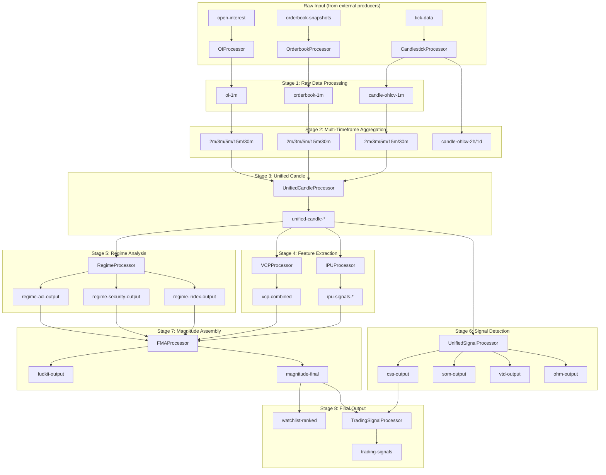

# StreamingCandle - Complete End-to-End Architecture

## System Overview

This document covers the **entire** streamingcandle system - from raw tick data to final trading signals.

---

## Complete Data Flow



---

## All Processors (10 Total)

### 1. CandlestickProcessor
**File:** `processor/CandlestickProcessor.java`

**Purpose:** Converts raw tick data into enriched OHLCV candles

| Input Topic | Output Topics |
|-------------|---------------|
| `tick-data` | `candle-ohlcv-1m`, `candle-ohlcv-2m`, `candle-ohlcv-3m`, `candle-ohlcv-5m`, `candle-ohlcv-15m`, `candle-ohlcv-30m`, `candle-ohlcv-2h`, `candle-ohlcv-1d` |

**Model:** `TickData` → `EnrichedCandlestick`

**Key Fields:**
```java
EnrichedCandlestick {
    open, high, low, close, volume
    buyVolume, sellVolume
    vwap
    volumeAtPrice (Map<Double, Long>) // Volume Profile
    volumeImbalance, dollarImbalance  // Imbalance Bars
    vpin                              // VPIN
    poc, valueAreaHigh, valueAreaLow  // Volume Profile
}
```

---

### 2. OrderbookProcessor
**File:** `processor/OrderbookProcessor.java`

**Purpose:** Converts orderbook snapshots into microstructure signals

| Input Topic | Output Topics |
|-------------|---------------|
| `orderbook-snapshots` | `orderbook-1m`, `orderbook-2m`, `orderbook-3m`, `orderbook-5m`, `orderbook-15m`, `orderbook-30m` |

**Model:** `OrderBookSnapshot` → `OrderbookAggregate`

**Key Fields:**
```java
OrderbookAggregate {
    ofi                    // Order Flow Imbalance (full-depth)
    depthImbalance         // Bid vs Ask depth
    kyleLambda            // Price impact coefficient
    microprice            // Fair value from orderbook
    bidAskSpread          // Spread
    totalBidDepth, totalAskDepth
    avgBidVwap, avgAskVwap
    icebergDetected       // Iceberg detection
    spoofingDetected      // Spoofing detection
}
```

---

### 3. OIProcessor
**File:** `processor/OIProcessor.java`

**Purpose:** Tracks Open Interest changes over time

| Input Topic | Output Topics |
|-------------|---------------|
| `open-interest` | `oi-1m`, `oi-2m`, `oi-3m`, `oi-5m`, `oi-15m`, `oi-30m` |

**Model:** `OpenInterest` → `OIAggregate`

**Key Fields:**
```java
OIAggregate {
    oiOpen, oiHigh, oiLow, oiClose
    oiChange, oiChangePercent
    putOI, callOI
}
```

---

### 4. UnifiedCandleProcessor
**File:** `processor/UnifiedCandleProcessor.java`

**Purpose:** Joins EnrichedCandlestick + OrderbookAggregate + OIAggregate

| Input Topics | Output Topics |
|--------------|---------------|
| `candle-ohlcv-*`, `orderbook-*`, `oi-*` | `unified-candle-1m`, `unified-candle-2m`, `unified-candle-3m`, `unified-candle-5m`, `unified-candle-15m`, `unified-candle-30m` |

**Model:** `EnrichedCandlestick` + `OrderbookAggregate` + `OIAggregate` → `UnifiedCandle`

**Key Fields:**
```java
UnifiedCandle {
    // From EnrichedCandlestick
    open, high, low, close, volume
    buyVolume, sellVolume, vwap
    volumeAtPrice, poc, valueAreaHigh, valueAreaLow
    volumeImbalance, dollarImbalance, vpin
    
    // From OrderbookAggregate
    ofi, depthImbalance, kyleLambda
    microprice, bidAskSpread
    totalBidDepth, totalAskDepth
    
    // From OIAggregate
    oiOpen, oiHigh, oiLow, oiClose
    oiChange, oiChangePercent
    putOI, callOI
}
```

---

### 5. IPUProcessor
**File:** `processor/IPUProcessor.java`

**Purpose:** Calculates Institutional Participation & Urgency with Momentum

| Input Topics | Output Topics |
|--------------|---------------|
| `unified-candle-5m`, `unified-candle-15m`, `unified-candle-30m` | `ipu-signals-5m`, `ipu-signals-15m`, `ipu-signals-30m`, `ipu-combined` |

**Model:** `UnifiedCandle` → `IPUOutput`

**Key Fields:**
```java
IPUOutput {
    finalIpuScore             // 0-1 combined score
    volExpansionScore         // Volume vs SMA20
    priceEfficiency           // Move efficiency
    ofQuality                 // Order flow quality
    instProxy                 // Institutional proxy
    momentumContext           // Momentum score
    slopeMagnitude, accelMagnitude
    exhaustionScore           // 0-1 exhaustion
    urgencyLevel              // AGGRESSIVE, ELEVATED, PATIENT, PASSIVE
    direction                 // BULLISH, BEARISH, NEUTRAL
    xfactorScore              // X-factor (exceptional move)
}
```

---

### 6. VCPProcessor
**File:** `processor/VCPProcessor.java`

**Purpose:** Detects Volume Cluster & Profile patterns

| Input Topics | Output Topics |
|--------------|---------------|
| `unified-candle-5m`, `unified-candle-15m`, `unified-candle-30m` | `vcp-output-5m`, `vcp-output-15m`, `vcp-output-30m`, `vcp-combined` |

**Model:** `UnifiedCandle` → `MTVCPOutput`

**Key Fields:**
```java
MTVCPOutput {
    vcpCombinedScore        // 0-1 combined
    vcp5m, vcp15m, vcp30m   // Per-TF scores
    structuralBias          // -1 to +1
    clusterStrength         // Cluster quality
    runwayScore             // Path clearance
    combinedPOC             // Weighted POC
    combinedVAH, combinedVAL
}
```

---

### 7. TradingSignalProcessor
**File:** `processor/TradingSignalProcessor.java`

**Purpose:** Generates final trading signals from all inputs

| Input Topics | Output Topics |
|--------------|---------------|
| Multiple (unified candles, IPU, VCP) | `trading-signals` |

**Model:** Various → `TradingSignal`

**Key Fields:**
```java
TradingSignal {
    scripCode, companyName
    signal                  // STRONG_BUY, BUY, HOLD, SELL, STRONG_SELL
    confidence              // 0-1
    entryPrice, stopLoss, targetPrice
    reasoning               // Why this signal
}
```

---

### 8. RegimeProcessor
**File:** `regime/processor/RegimeProcessor.java`

**Purpose:** Calculates market-wide and stock-specific regime

| Input Topics | Output Topics |
|--------------|---------------|
| `unified-candle-5m`, `unified-candle-30m`, `candle-ohlcv-2h`, `candle-ohlcv-1d` | `regime-index-output`, `regime-security-output`, `regime-acl-output` |

**Models:**
- `IndexRegime` - NIFTY50/BANKNIFTY trend analysis
- `SecurityRegime` - Per-stock EMA alignment
- `ACLOutput` - Trend age / anti-cycle

---

### 9. FMAProcessor
**File:** `capital/processor/FMAProcessor.java`

**Purpose:** Assembles final magnitude ranking

| Input Topics | Output Topics |
|--------------|---------------|
| `unified-candle-5m`, `ipu-signals-5m`, `vcp-combined`, `regime-*` | `magnitude-final`, `fudkii-output` |

**Model:** All inputs → `FinalMagnitude`

**Key Fields:**
```java
FinalMagnitude {
    finalMagnitude          // 0-1 THE SCORE
    direction               // BULLISH, BEARISH, NEUTRAL
    directionConfidence     // 0-1
    signalType              
    components {            // Component breakdown
        ipuScore, vcpScore, regimeStrength, fudkiiStrength
    }
    multipliers {           // Applied multipliers
        aclMultiplier, volumeMultiplier, cssMultiplier, regimeMultiplier
    }
    penalties {             // Applied penalties
        somPenalty, vtdPenalty, exhaustionPenalty
    }
    tradeParams {           // Trade parameters
        entryPrice, stopLoss, target1, target2
    }
}
```

---

### 10. UnifiedSignalProcessor
**File:** `signal/processor/UnifiedSignalProcessor.java`

**Purpose:** Generates CSS, SOM, VTD, OHM, and Watchlist

| Input Topics | Output Topics |
|--------------|---------------|
| `unified-candle-5m`, `vcp-combined`, `magnitude-final` | `css-output`, `som-output`, `vtd-output`, `ohm-output`, `watchlist-ranked` |

---

## Complete Topic List (42 Topics)

### Raw Input Topics (3)
| Topic | Producer | Content |
|-------|----------|---------|
| `tick-data` | External | Raw tick/trade data |
| `orderbook-snapshots` | External | L2 orderbook |
| `open-interest` | External | OI updates from exchange |

### Candle Topics (8)
| Topic | Producer | Content |
|-------|----------|---------|
| `candle-ohlcv-1m` | CandlestickProcessor | 1-min enriched candles |
| `candle-ohlcv-2m` | CandlestickProcessor | 2-min candles |
| `candle-ohlcv-3m` | CandlestickProcessor | 3-min candles |
| `candle-ohlcv-5m` | CandlestickProcessor | 5-min candles |
| `candle-ohlcv-15m` | CandlestickProcessor | 15-min candles |
| `candle-ohlcv-30m` | CandlestickProcessor | 30-min candles |
| `candle-ohlcv-2h` | CandlestickProcessor | 2-hour candles |
| `candle-ohlcv-1d` | CandlestickProcessor | Daily candles |

### Orderbook Topics (6)
| Topic | Producer | Content |
|-------|----------|---------|
| `orderbook-1m` | OrderbookProcessor | 1-min microstructure |
| `orderbook-2m` | OrderbookProcessor | 2-min |
| `orderbook-3m` | OrderbookProcessor | 3-min |
| `orderbook-5m` | OrderbookProcessor | 5-min |
| `orderbook-15m` | OrderbookProcessor | 15-min |
| `orderbook-30m` | OrderbookProcessor | 30-min |

### OI Topics (6)
| Topic | Producer | Content |
|-------|----------|---------|
| `oi-1m` | OIProcessor | 1-min OI metrics |
| `oi-2m` | OIProcessor | 2-min |
| `oi-3m` | OIProcessor | 3-min |
| `oi-5m` | OIProcessor | 5-min |
| `oi-15m` | OIProcessor | 15-min |
| `oi-30m` | OIProcessor | 30-min |

### Unified Candle Topics (6)
| Topic | Producer | Content |
|-------|----------|---------|
| `unified-candle-1m` | UnifiedCandleProcessor | OHLCV+OB+OI combined |
| `unified-candle-2m` | UnifiedCandleProcessor | |
| `unified-candle-3m` | UnifiedCandleProcessor | |
| `unified-candle-5m` | UnifiedCandleProcessor | **Most used** |
| `unified-candle-15m` | UnifiedCandleProcessor | |
| `unified-candle-30m` | UnifiedCandleProcessor | **Used for regime** |

### Feature Topics (7)
| Topic | Producer | Content |
|-------|----------|---------|
| `ipu-signals-5m` | IPUProcessor | IPU for 5m |
| `ipu-signals-15m` | IPUProcessor | IPU for 15m |
| `ipu-signals-30m` | IPUProcessor | IPU for 30m |
| `ipu-combined` | IPUProcessor | Multi-TF fusion |
| `vcp-output-5m` | VCPProcessor | VCP for 5m |
| `vcp-output-30m` | VCPProcessor | VCP for 30m |
| `vcp-combined` | VCPProcessor | Multi-TF fusion |

### Regime Topics (3)
| Topic | Producer | Content |
|-------|----------|---------|
| `regime-index-output` | RegimeProcessor | NIFTY50/BANKNIFTY |
| `regime-security-output` | RegimeProcessor | Per-stock regime |
| `regime-acl-output` | RegimeProcessor | Trend age / ACL |

### Signal Topics (4)
| Topic | Producer | Content |
|-------|----------|---------|
| `css-output` | UnifiedSignalProcessor | Structure score |
| `som-output` | UnifiedSignalProcessor | Choppiness |
| `vtd-output` | UnifiedSignalProcessor | Volatility traps |
| `ohm-output` | UnifiedSignalProcessor | Option health |

### Final Output Topics (3)
| Topic | Producer | Content |
|-------|----------|---------|
| `fudkii-output` | FMAProcessor | Ignition signals |
| `magnitude-final` | FMAProcessor | **THE ranking** |
| `watchlist-ranked` | UnifiedSignalProcessor | Top opportunities |

---

## Debug Commands

### Watch Raw Input
```bash
# Tick data
kafka-console-consumer.sh --bootstrap-server 13.203.60.173:9094 \
  --topic tick-data --max-messages 5 | jq '.'

# Orderbook
kafka-console-consumer.sh --bootstrap-server 13.203.60.173:9094 \
  --topic orderbook-snapshots --max-messages 5 | jq '.'
```

### Watch Stage 1 (Raw Processing)
```bash
# 1-min candles
kafka-console-consumer.sh --bootstrap-server 13.203.60.173:9094 \
  --topic candle-ohlcv-1m --property print.key=true | jq '.'

# 1-min orderbook
kafka-console-consumer.sh --bootstrap-server 13.203.60.173:9094 \
  --topic orderbook-1m --property print.key=true | jq '.'

# 1-min OI
kafka-console-consumer.sh --bootstrap-server 13.203.60.173:9094 \
  --topic oi-1m --property print.key=true | jq '.'
```

### Watch Stage 3 (Unified Candle)
```bash
# 5-min unified (most important!)
kafka-console-consumer.sh --bootstrap-server 13.203.60.173:9094 \
  --topic unified-candle-5m --property print.key=true | jq '.'
```

### Watch Stage 4 (Features)
```bash
# IPU
kafka-console-consumer.sh --bootstrap-server 13.203.60.173:9094 \
  --topic ipu-signals-5m --property print.key=true | jq '.finalIpuScore, .direction'

# VCP
kafka-console-consumer.sh --bootstrap-server 13.203.60.173:9094 \
  --topic vcp-combined --property print.key=true | jq '.vcpCombinedScore'
```

### Watch Stage 5 (Regime)
```bash
# Index regime
kafka-console-consumer.sh --bootstrap-server 13.203.60.173:9094 \
  --topic regime-index-output | jq '.indexName, .regimeStrength, .label'

# Security regime
kafka-console-consumer.sh --bootstrap-server 13.203.60.173:9094 \
  --topic regime-security-output | jq '.scripCode, .finalRegimeScore, .isAlignedWithIndex'
```

### Watch Final Output
```bash
# THE MAIN OUTPUT - Magnitude
kafka-console-consumer.sh --bootstrap-server 13.203.60.173:9094 \
  --topic magnitude-final --property print.key=true | jq '{
    scripCode: .scripCode,
    magnitude: .finalMagnitude,
    direction: .direction,
    confidence: .directionConfidence
  }'

# Watchlist (sorted by magnitude)
kafka-console-consumer.sh --bootstrap-server 13.203.60.173:9094 \
  --topic watchlist-ranked | jq '.rank, .scripCode, .finalMagnitude'

# Ignition signals
kafka-console-consumer.sh --bootstrap-server 13.203.60.173:9094 \
  --topic fudkii-output | jq 'select(.isIgnitionFlag==true)'
```

---

## Startup Order

Processors start in this order (with delays):

1. **CandlestickProcessor** (0s) - Starts immediately
2. **OrderbookProcessor** (5s delay)
3. **OIProcessor** (5s delay)
4. **UnifiedCandleProcessor** (10s delay) - Waits for 1,2,3
5. **IPUProcessor** (15s delay) - Waits for 4
6. **VCPProcessor** (15s delay) - Waits for 4
7. **RegimeProcessor** (20s delay) - Waits for 4
8. **TradingSignalProcessor** (25s delay) - Waits for 5,6
9. **FMAProcessor** (25s delay) - Waits for 5,6,7
10. **UnifiedSignalProcessor** (30s delay) - Waits for 9

---

## File Structure

```
src/main/java/com/kotsin/consumer/
├── config/
│   ├── KafkaConfig.java          # Kafka stream properties
│   └── KafkaTopics.java          # Topic name constants
├── model/
│   ├── TickData.java             # Raw tick data
│   ├── OrderBookSnapshot.java    # Raw orderbook
│   ├── OpenInterest.java         # Raw OI
│   ├── EnrichedCandlestick.java  # Enriched OHLCV
│   ├── OrderbookAggregate.java   # Orderbook metrics
│   ├── OIAggregate.java          # OI metrics
│   ├── UnifiedCandle.java        # Combined model
│   ├── IPUOutput.java            # IPU output
│   ├── MTVCPOutput.java          # VCP output
│   └── TradingSignal.java        # Final signal
├── processor/
│   ├── CandlestickProcessor.java
│   ├── OrderbookProcessor.java
│   ├── OIProcessor.java
│   ├── UnifiedCandleProcessor.java
│   ├── IPUProcessor.java
│   ├── VCPProcessor.java
│   └── TradingSignalProcessor.java
├── regime/
│   ├── model/
│   │   ├── RegimeLabel.java
│   │   ├── IndexRegime.java
│   │   ├── SecurityRegime.java
│   │   └── ACLOutput.java
│   ├── service/
│   │   ├── IndexRegimeCalculator.java
│   │   ├── SecurityRegimeCalculator.java
│   │   └── AntiCycleLimiter.java
│   └── processor/
│       └── RegimeProcessor.java
├── signal/
│   ├── model/
│   │   ├── FUDKIIOutput.java
│   │   ├── CSSOutput.java
│   │   ├── SOMOutput.java
│   │   └── VTDOutput.java
│   ├── service/
│   │   ├── FUDKIICalculator.java
│   │   ├── CompositeStructureScore.java
│   │   ├── SentimentOscillationModule.java
│   │   └── VolatilityTrapDetector.java
│   └── processor/
│       └── UnifiedSignalProcessor.java
├── capital/
│   ├── model/
│   │   ├── FinalMagnitude.java
│   │   ├── OptionHealthOutput.java
│   │   ├── CorrelationGuardrailOutput.java
│   │   └── WatchlistEntry.java
│   ├── service/
│   │   ├── FinalMagnitudeAssembly.java
│   │   ├── OptionHealthModule.java
│   │   └── CorrelationGuardrail.java
│   ├── orchestrator/
│   │   └── WatchlistOrchestrator.java
│   └── processor/
│       └── FMAProcessor.java
├── service/
│   ├── InstrumentMetadataService.java
│   └── TradingHoursValidationService.java
└── util/
    ├── TTLCache.java
    └── CircuitBreaker.java
```

---

## Troubleshooting

### No data flowing

1. Check if tick-data is coming:
```bash
kafka-console-consumer.sh --bootstrap-server 13.203.60.173:9094 \
  --topic tick-data --max-messages 1
```

2. Check processor states in logs:
```bash
grep "state:" logs/app.log | tail -20
```

3. Check for errors:
```bash
grep "ERROR" logs/app.log | tail -20
```

### magnitude-final always 0

1. Check IPU is flowing:
```bash
kafka-console-consumer.sh --bootstrap-server 13.203.60.173:9094 \
  --topic ipu-signals-5m --max-messages 3
```

2. Check VCP is flowing:
```bash
kafka-console-consumer.sh --bootstrap-server 13.203.60.173:9094 \
  --topic vcp-combined --max-messages 3
```

3. Check regime is flowing:
```bash
kafka-console-consumer.sh --bootstrap-server 13.203.60.173:9094 \
  --topic regime-index-output --max-messages 1
```

### High memory usage

Check cache sizes:
```bash
grep "Cache.*size=" logs/app.log
```

Reduce TTL:
```properties
fma.cache.ttl.ms=120000  # 2 min
signal.cache.ttl.ms=120000
```
