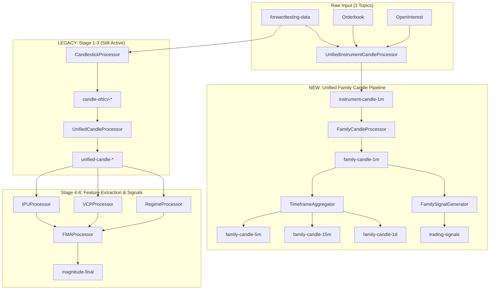

# StreamingCandle - Complete End-to-End Architecture

## System Overview

This document covers the **entire** streamingcandle system - from raw tick data to final trading signals.

**NEW (Dec 2024):** Added Unified Family Candle Architecture for cross-instrument analysis.

---

## Complete Data Flow



---

## NEW: Unified Family Candle Architecture

### Overview

The new architecture combines **Equity + Future + Options** into a single **FamilyCandle** for cross-instrument analysis.

### Data Flow

```
forwardtesting-data ─┐
                     ├─► UnifiedInstrumentCandleProcessor ─► instrument-candle-1m
Orderbook ───────────┤        (LEFT JOIN - tick mandatory)
                     │
OpenInterest ────────┘
                                        │
                                        ▼
                              FamilyCandleProcessor
                              (Groups by equity family)
                                        │
                                        ▼
                              family-candle-1m
                                        │
                                        ▼
                              TimeframeAggregator
                              ┌────────┴────────┐
                              ▼                 ▼
                      family-candle-5m   family-candle-1d
                              │
                              ▼
                      FamilySignalGenerator
                              │
                              ▼
                      trading-signals
```

### Key Features

1. **LEFT JOIN Semantics**: Tick data is mandatory, orderbook/OI are optional
2. **Adaptive VPIN**: Bucket size = avgDailyVolume / 50 (fixes hardcoded bug)
3. **Cross-Instrument OI Signals**: BULLISH_ACCUMULATION, BEARISH_DISTRIBUTION, etc.
4. **Data Availability Flags**: `hasOrderbook`, `hasOI` for strategy modules

### Data Availability Pattern

| Instrument | OHLCV | Orderbook | OI |
|------------|-------|-----------|-----|
| Index      | ✅    | ❌        | ❌  |
| Equity     | ✅    | ✅        | ❌  |
| Derivatives| ✅    | ✅        | ✅  |

---

## NEW: Processors

### 11. UnifiedInstrumentCandleProcessor
**File:** `infrastructure/kafka/UnifiedInstrumentCandleProcessor.java`

**Purpose:** Joins tick + orderbook + OI into InstrumentCandle

| Input Topics | Output Topic |
|--------------|--------------|
| `forwardtesting-data`, `Orderbook`, `OpenInterest` | `instrument-candle-1m` |

**Model:** `TickData` + `OrderBookSnapshot` + `OpenInterest` → `InstrumentCandle`

**Key Fields:**
```java
InstrumentCandle {
    // Identity
    scripCode, symbol, companyName
    instrumentType  // EQUITY, FUTURE, OPTION_CE, OPTION_PE, INDEX
    
    // OHLCV
    open, high, low, close, volume
    buyVolume, sellVolume, vwap, vpin
    
    // Orderbook (optional)
    ofi, kyleLambda, microprice, bidAskSpread
    hasOrderbook  // Flag for strategy modules
    
    // OI (optional)
    openInterest, oiChange, oiChangePercent
    hasOI  // Flag for strategy modules
    
    // Options (if applicable)
    strikePrice, optionType, expiry
    
    // Quality
    quality  // VALID, WARNING, CONFLICT, STALE
}
```

---

### 12. FamilyCandleProcessor
**File:** `infrastructure/kafka/FamilyCandleProcessor.java`

**Purpose:** Groups instruments into family candles

| Input Topic | Output Topic |
|-------------|--------------|
| `instrument-candle-1m` | `family-candle-1m` |

**Model:** `InstrumentCandle[]` → `FamilyCandle`

**Key Fields:**
```java
FamilyCandle {
    // Identity
    familyId, symbol, timeframe
    
    // Instruments
    equity        // InstrumentCandle
    future        // InstrumentCandle (may be null)
    options       // List<OptionCandle> (4 ATM options)
    
    // Cross-Instrument Metrics
    spotFuturePremium    // (futureClose - equityClose) / equityClose
    futuresBuildup       // LONG_BUILDUP, SHORT_BUILDUP, etc.
    pcr                  // Put/Call Ratio
    oiSignal            // BULLISH_ACCUMULATION, etc.
    
    // OI Dynamics
    totalCallOI, totalPutOI
    totalCallOIChange, totalPutOIChange
    callOiBuildingUp, putOiUnwinding
    
    // Confluence
    directionalBias      // BULLISH, BEARISH, NEUTRAL
    biasConfidence       // 0.0 - 1.0
}
```

---

### 13. TimeframeAggregator
**File:** `infrastructure/kafka/TimeframeAggregator.java`

**Purpose:** Aggregates 1m → higher timeframes

| Input Topic | Output Topics |
|-------------|---------------|
| `family-candle-1m` | `family-candle-{2m,3m,5m,15m,30m,1h,2h,4h,1d}` |

---

### 14. FamilySignalGenerator
**File:** `domain/service/FamilySignalGenerator.java`

**Purpose:** Generates signals from FamilyCandle

**Signal Generation Rules:**
1. Requires 3+ confirming factors for STRONG signal
2. Factors: price action, OI signal, futures buildup, PCR, premium, volume
3. Comprehensive logging at ALL levels

---

## NEW: Domain Models

### InstrumentType
```java
enum InstrumentType {
    INDEX,       // hasOrderbook=false, hasOI=false
    EQUITY,      // hasOrderbook=true,  hasOI=false
    FUTURE,      // hasOrderbook=true,  hasOI=true
    OPTION_CE,   // hasOrderbook=true,  hasOI=true
    OPTION_PE    // hasOrderbook=true,  hasOI=true
}
```

### DataQuality
```java
enum DataQuality {
    VALID,        // All data consistent
    WARNING,      // Low correlation between metrics
    CONFLICT,     // Trade imbalance conflicts with OFI
    STALE,        // Old/missing data
    INSUFFICIENT  // Not enough data
}
```

---

## NEW: Calculators

| Calculator | Purpose | Location |
|------------|---------|----------|
| `AdaptiveVPINCalculator` | Adaptive bucket sizing | `domain/calculator/` |
| `OFICalculator` | Order Flow Imbalance | `domain/calculator/` |
| `PCRCalculator` | Put/Call Ratio | `domain/calculator/` |
| `FuturesBuildupDetector` | LONG/SHORT buildup | `domain/calculator/` |
| `OISignalDetector` | Cross-instrument signals | `domain/calculator/` |

### OI Signal Types
```
BULLISH_ACCUMULATION  - Price ↑ + Future OI ↑ + Call OI ↑
BEARISH_DISTRIBUTION  - Price ↓ + Future OI ↑ + Put OI ↑  
SHORT_COVERING_RALLY  - Price ↑ + Future OI ↓ + Put OI ↓
LONG_UNWINDING        - Price ↓ + Future OI ↓ + Call OI ↓
CALL_WRITING          - Price ↓ + Call OI ↑ (bearish)
PUT_WRITING           - Price ↑ + Put OI ↑ (bullish)
```

---

## NEW: Kafka Topics

### Family Candle Topics (13 new)
| Topic | Producer | Content |
|-------|----------|---------|
| `instrument-candle-1m` | UnifiedInstrumentCandleProcessor | Individual instrument candles |
| `family-candle-1m` | FamilyCandleProcessor | Cross-instrument family |
| `family-candle-2m` | TimeframeAggregator | 2-min aggregated |
| `family-candle-3m` | TimeframeAggregator | 3-min aggregated |
| `family-candle-5m` | TimeframeAggregator | **Primary timeframe** |
| `family-candle-15m` | TimeframeAggregator | 15-min aggregated |
| `family-candle-30m` | TimeframeAggregator | 30-min aggregated |
| `family-candle-1h` | TimeframeAggregator | Hourly |
| `family-candle-2h` | TimeframeAggregator | 2-hour |
| `family-candle-4h` | TimeframeAggregator | 4-hour |
| `family-candle-1d` | TimeframeAggregator | Daily |
| `family-candle-1wk` | TimeframeAggregator | Weekly |
| `family-candle-1mo` | TimeframeAggregator | Monthly |

---

## Configuration

### New Properties (application.properties)
```properties
# Unified Processor
unified.processor.enabled=true
unified.input.topic.ticks=forwardtesting-data
unified.input.topic.orderbook=Orderbook
unified.input.topic.oi=OpenInterest
unified.output.topic.instrument=instrument-candle-1m
unified.window.grace.seconds=5

# Family Processor
family.candle.window.grace.seconds=5
family.cache.ttl.hours=24
family.cache.refresh.on.miss=true

# Timeframe Aggregator
timeframe.aggregator.enabled=true

# ScripFinder API
scripfinder.api.base-url=http://13.203.60.173:8102
scripfinder.api.timeout.ms=3000
```

---

## Debug Commands (Family Candle)

### Watch Instrument Candles
```bash
kafka-console-consumer.sh --bootstrap-server 13.203.60.173:9094 \
  --topic instrument-candle-1m --property print.key=true | jq '{
    type: .instrumentType,
    symbol: .companyName,
    close: .close,
    hasOB: .orderbookPresent,
    hasOI: .oiPresent
  }'
```

### Watch Family Candles
```bash
kafka-console-consumer.sh --bootstrap-server 13.203.60.173:9094 \
  --topic family-candle-5m --property print.key=true | jq '{
    family: .familyId,
    symbol: .symbol,
    hasFuture: .hasFuture,
    hasOptions: .hasOptions,
    oiSignal: .oiSignal,
    pcr: .pcr,
    buildup: .futuresBuildup,
    bias: .directionalBias
  }'
```

### Watch Signals
```bash
kafka-console-consumer.sh --bootstrap-server 13.203.60.173:9094 \
  --topic trading-signals | jq '{
    symbol: .symbol,
    signal: .signalType,
    strength: .signalStrength,
    confidence: .confidence,
    reason: .primaryReason
  }'
```

---

## File Structure (Updated)

```
src/main/java/com/kotsin/consumer/
├── config/
│   ├── KafkaConfig.java
│   └── KafkaTopics.java              # Updated with family topics
│
├── domain/                           # NEW: Domain layer
│   ├── model/
│   │   ├── InstrumentType.java       # INDEX, EQUITY, FUTURE, OPTION_CE/PE
│   │   ├── DataQuality.java          # VALID, WARNING, CONFLICT, STALE
│   │   ├── InstrumentCandle.java     # Unified candle model
│   │   ├── OptionCandle.java         # Option-specific fields
│   │   ├── FamilyCandle.java         # Cross-instrument family
│   │   └── InstrumentFamily.java     # Equity→Future+Options mapping
│   │
│   ├── calculator/
│   │   ├── AdaptiveVPINCalculator.java
│   │   ├── OFICalculator.java
│   │   ├── PCRCalculator.java
│   │   ├── FuturesBuildupDetector.java
│   │   └── OISignalDetector.java
│   │
│   ├── validator/
│   │   └── TradeOrderbookValidator.java
│   │
│   └── service/
│       └── FamilySignalGenerator.java
│
├── infrastructure/                   # NEW: Infrastructure layer
│   ├── api/
│   │   └── ScripFinderClient.java    # ScripFinder API client
│   │
│   ├── redis/
│   │   └── FamilyCacheAdapter.java   # Family cache
│   │
│   └── kafka/
│       ├── UnifiedInstrumentCandleProcessor.java
│       ├── FamilyCandleProcessor.java
│       └── TimeframeAggregator.java
│
├── model/                            # LEGACY models
├── processor/                        # LEGACY processors
├── regime/
├── signal/
├── capital/
├── service/
└── util/
```

---

## Startup Order (Updated)

```
1. UnifiedInstrumentCandleProcessor (0s)    # NEW
2. CandlestickProcessor (0s)
3. OrderbookProcessor (5s)
4. OIProcessor (5s)
5. FamilyCandleProcessor (5s)               # NEW
6. TimeframeAggregator (10s)                # NEW
7. UnifiedCandleProcessor (10s)
8. IPUProcessor (15s)
9. VCPProcessor (15s)
10. RegimeProcessor (20s)
11. TradingSignalProcessor (25s)
12. FMAProcessor (25s)
13. UnifiedSignalProcessor (30s)
```

---

## LEGACY Sections

The following sections document the **original** architecture which is still active:

### All Processors (Original 10)

[Content preserved from original - CandlestickProcessor, OrderbookProcessor, OIProcessor, etc.]

### Complete Topic List (Original 42)

[Content preserved from original]

---

## Troubleshooting

### New: Family Candle Issues

**No family candles flowing:**
```bash
# Check instrument candles first
kafka-console-consumer.sh --bootstrap-server 13.203.60.173:9094 \
  --topic instrument-candle-1m --max-messages 3

# Check ScripFinder API
curl "http://13.203.60.173:8102/getRequiredFuture?equityScripCode=14154"
```

**Missing OI signals:**
```bash
# Check if OI data is flowing
kafka-console-consumer.sh --bootstrap-server 13.203.60.173:9094 \
  --topic OpenInterest --max-messages 3
```

**Empty options in family:**
```bash
# Check options API
curl "http://13.203.60.173:8102/getRequiredOptions?equityScripCode=14154"
```

### Logging

Enable debug logging for family candle processing:
```properties
logging.level.com.kotsin.consumer.infrastructure.kafka=DEBUG
logging.level.com.kotsin.consumer.domain.service=DEBUG
logging.level.com.kotsin.consumer.domain.calculator=DEBUG
```
