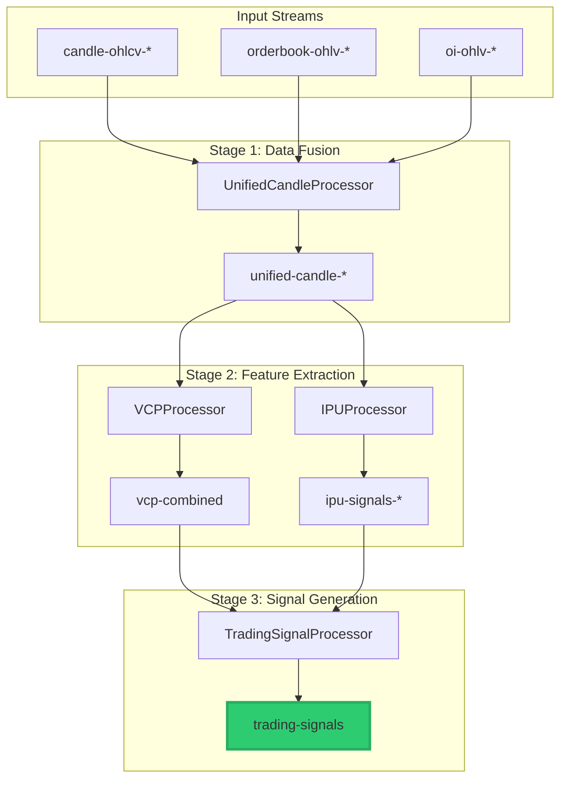

# 🎯 Trading Signals Pipeline

A real-time Kafka Streams pipeline that fuses **Volume Cluster Pivot (VCP)** analysis with **Institutional Participation & Urgency (IPU)** signals to generate actionable trading recommendations.

---

## 📊 Architecture Overview



---

## 🔧 Key Components

| Component | Description |
|-----------|-------------|
| **UnifiedCandle** | Merged OHLCV + Orderbook + OI data model |
| **VCPCalculator** | Volume profile, cluster detection, support/resistance scoring |
| **IPUCalculator** | 16-step algorithm: efficiency, flow quality, momentum, exhaustion |
| **TradingSignal** | Final output with signal classification and position sizing |

---

## 📡 Kafka Topics

### Input Topics
| Topic Pattern | Data |
|--------------|------|
| `candle-ohlcv-{1m,2m,3m,5m,15m,30m}` | OHLCV + volume profile |
| `orderbook-ohlv-{tf}` | OFI, depth, Kyle's Lambda |
| `oi-ohlv-{tf}` | Open Interest OHLC |

### Intermediate Topics
| Topic | Content |
|-------|---------|
| `unified-candle-{tf}` | Merged Candle + Orderbook + OI |
| `vcp-combined` | Multi-TF VCP scores + clusters |
| `ipu-signals-{5m,15m,30m}` | Per-TF IPU scores |

### Output Topic
| Topic | Content |
|-------|---------|
| **`trading-signals`** | Final actionable signals with position sizing |

---

## 🎯 Signal Types

| Signal | When Triggered | Action |
|--------|----------------|--------|
| `STRONG_MOMENTUM_LONG` | Clean runway + bullish momentum + institutional | Enter long with conviction |
| `STRONG_MOMENTUM_SHORT` | Clean runway + bearish momentum + institutional | Enter short with conviction |
| `FADE_EXHAUSTION_SHORT` | Bullish exhaustion at resistance | Fade the rally |
| `FADE_EXHAUSTION_LONG` | Bearish exhaustion at support | Fade the selloff |
| `CONFIRMED_BOUNCE_LONG` | Accelerating momentum off support | Long at support |
| `CONFIRMED_BREAKDOWN_SHORT` | Breaking support with momentum | Short the break |
| `DIVERGENCE_WARNING` | Momentum losing flow support | Reduce exposure |
| `ACCUMULATION_DETECTED` | Institutional buying, flat price | Prepare for breakout |
| `DISTRIBUTION_DETECTED` | Institutional selling, flat price | Prepare for breakdown |

---

## 📈 Sample Output

```json
{
  "scripCode": "N:C:11536",
  "signal": "STRONG_MOMENTUM_LONG",
  "confidence": 0.78,
  "rationale": "Clean runway + bullish momentum + institutional participation",
  
  "vcpCombinedScore": 0.42,
  "supportScore": 0.65,
  "resistanceScore": 0.25,
  "structuralBias": 0.45,
  "runwayScore": 0.72,
  
  "ipuFinalScore": 0.68,
  "momentumState": "ACCELERATING",
  "urgencyLevel": "ELEVATED",
  "direction": "BULLISH",
  "exhaustionWarning": false,
  
  "positionSizeMultiplier": 1.32,
  "trailAtrMultiplier": 1.5,
  "atr": 15.50
}
```

---

## ⚙️ Configuration

### Enable/Disable Modules
```properties
unified.enabled=true
vcp.enabled=true
ipu.enabled=true
trading.enabled=true
```

### VCP Parameters
```properties
vcp.lookback.5m=48    # 4 hours of 5m candles
vcp.lookback.15m=32   # 8 hours of 15m candles
vcp.lookback.30m=24   # 12 hours of 30m candles
vcp.peak-threshold-sigma=1.5
vcp.max-clusters=5
```

### IPU Parameters
```properties
ipu.volume-sma-period=20
ipu.momentum-lookback=3
ipu.exhaustion-decline-threshold=0.8
ipu.mtf-weight-5m=0.40
ipu.mtf-weight-15m=0.35
ipu.mtf-weight-30m=0.25
```

---

## 🚀 Processor Startup Sequence

```
t=0s   → UnifiedCandleProcessor (6 timeframes)
t=10s  → VCPProcessor (5m, 15m, 30m)
t=12s  → IPUProcessor (5m, 15m, 30m)
t=18s  → TradingSignalProcessor
```

All processors start automatically via `@PostConstruct`.

---

## 📊 Interpretation Guide

### VCP Combined Score
| Score | Meaning |
|-------|---------|
| ≥ 0.80 | Major institutional levels, expect chop |
| 0.65-0.80 | Significant structure, breakouts need conviction |
| 0.45-0.65 | Moderate structure |
| 0.25-0.45 | Weak structure, room to trend |
| < 0.25 | "Open air" - no meaningful clusters |

### IPU Final Score
| Score | Meaning |
|-------|---------|
| ≥ 0.80 | Extreme institutional activity |
| 0.60-0.80 | Strong institutional presence |
| 0.40-0.60 | Moderate activity |
| 0.20-0.40 | Weak signal |
| < 0.20 | No institutional footprint |

### Momentum States
| State | Action |
|-------|--------|
| `ACCELERATING` | Enter with trend, trail stops |
| `TRENDING` | Hold positions |
| `DECELERATING` | Tighten stops, partial exit |
| `DRIFTING` | Reduce size |
| `FLAT` | Avoid trend trades |

---

## 📁 File Structure

```
src/main/java/com/kotsin/consumer/
├── config/
│   ├── VCPConfig.java
│   └── IPUConfig.java
├── model/
│   ├── UnifiedCandle.java
│   ├── VCPCluster.java
│   ├── MTVCPOutput.java
│   ├── IPUOutput.java
│   └── TradingSignal.java
├── processor/
│   ├── UnifiedCandleProcessor.java
│   ├── VCPProcessor.java
│   ├── IPUProcessor.java
│   └── TradingSignalProcessor.java
└── service/
    ├── VCPCalculator.java
    └── IPUCalculator.java
```

---

## 🔗 Integration Examples

### Consuming Trading Signals (Java)
```java
KStream<String, TradingSignal> signals = builder.stream(
    "trading-signals",
    Consumed.with(Serdes.String(), TradingSignal.serde())
);

signals
    .filter((k, v) -> v.isLongSignal() && v.getConfidence() > 0.6)
    .foreach((scripCode, signal) -> {
        double size = baseSize * signal.getPositionSizeMultiplier();
        double stopLoss = signal.getAtr() * signal.getTrailAtrMultiplier();
        // Execute trade...
    });
```

### Position Sizing Logic
```java
// From TradingSignal
double momentum = signal.getPositionSizeMultiplier();  // 0.5 to 1.2
double trailATR = signal.getTrailAtrMultiplier();      // 0.7 to 1.5

// Adjust base size
double finalSize = baseRiskSize * momentum;
double stopDistance = signal.getAtr() * trailATR;
```

---

## ✅ Production Checklist

- [x] Per-scripCode caching (no cross-contamination)
- [x] Graceful shutdown with 30s timeout
- [x] Uncaught exception handling (thread replacement)
- [x] State store persistence
- [x] Configurable via `application.properties`
- [x] Feature toggles for each module

---

**Built with Kafka Streams + Spring Boot**

*Last updated: 2024-12-24*
